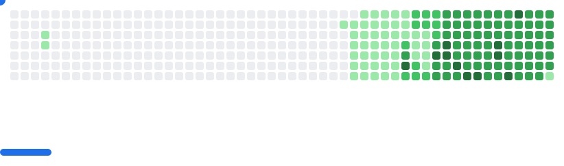

# Hello, I'm Ritesh Rana

 

 

## About Me

I am a Distributed Systems Engineer holding a Master's degree from Boston University. I specialize in cloud-native architectures, container orchestration, and high-performance backend systems. When I'm not writing production code, I'm usually architecting infrastructure or building out my bare-metal homelab.

- **Currently scaling:** Distributed machine learning orchestration and backend infrastructure.
- **Deep-diving into:** eBPF, Advanced Kubernetes Networking, and Rust.
- **Homelab Arsenal:** Proxmox, k3s, Ceph, and heavy automation.
- **Ask me about:** Distributed consensus, Terraform state management, and breaking monoliths.

## Engineering Arsenal

### Core Heavyweights

### Distributed Data & State

### Supporting Application Layer

## GitHub Achievements

## GitHub Analytics

  

## Featured Projects

<!-- FEATURED_PROJECTS_START -->

### Discover My Work

All my public repositories are showcased below and automatically updated! Each project represents a journey of learning, innovation, and contribution to the developer community.

### Latest Public Repositories

| Repository | Description | Language | Stars | Forks |
|---------------|-----------------|-------------|----------|----------|
| [**New-Grad-Jobs**](https://github.com/ambicuity/New-Grad-Jobs) | Welcome to New-Grad Jobs, a curated repository designed to h... | `Python` | 7 | 1 |
| [**Weather**](https://github.com/ambicuity/Weather) | No description | `N/A` | 0 | 0 |
| [**Weather-V2**](https://github.com/ambicuity/Weather-V2) | No description | `Python` | 0 | 0 |
| [**Awesome-MICCAI-2026**](https://github.com/ambicuity/Awesome-MICCAI-2026) | This repository automatically discovers and organizes MICCAI... | `Python` | 9 | 0 |
| [**dataset-health-monitor**](https://github.com/ambicuity/dataset-health-monitor) | Dataset Health Monitor is a "CI for datasets" - a production... | `Python` | 0 | 0 |
| [**awesome-failed-ml-experiments**](https://github.com/ambicuity/awesome-failed-ml-experiments) | Learning from failures is one of the most valuable skills in... | `Python` | 0 | 0 |

*Showing 6 of 8 public repositories - automatically updated via GitHub Actions*

<!-- FEATURED_PROJECTS_END -->

## Community Involvement

- **Open Source Contributions:** Active contributor to various open-source projects
- **Knowledge Sharing:** Writing technical articles and tutorials
- **Speaking:** Presenting at developer meetups and conferences
- **Mentoring:** Helping fellow developers grow their skills
- **Hackathons:** Participating in coding competitions and innovation challenges

## Contribution Activity

## 🎮 GitHub Breakout Game

<picture>
  <source
    media="(prefers-color-scheme: dark)"
    srcset="images/breakout-dark.svg"
  />
  <source
    media="(prefers-color-scheme: light)"
    srcset="images/breakout-light.svg"
  />
  
</picture>

  🕹️ <strong>Interactive Breakout Game</strong> powered by my GitHub contributions! 
  <em>Each block represents a day of coding - break them all!</em>

🎯 <strong>Game Stats & Info</strong>

- **🎨 Dynamic Generation**: Game updates daily based on real GitHub activity
- **🌈 Color Coding**: Contribution intensity determines block colors  
- **⚡ Interactive Elements**: Animated paddle and ball physics
- **🎪 Themes**: Supports both light and dark mode
- **📊 Data Source**: Built from actual GitHub contribution graph
- **🔄 Loading State**: Shows "Loading..." animation when game is being generated

*Game automatically regenerates every 24 hours with fresh contribution data. If you see "Breakout Game Loading..." it means the interactive version is being generated from the latest GitHub contributions!*

## Recent GitHub Activity

<!--START_SECTION:activity-->
1. ℹ️ Reopened PR [#1836](https://github.com/hiero-ledger/hiero-sdk-python/pull/1836) in [hiero-ledger/hiero-sdk-python](https://github.com/hiero-ledger/hiero-sdk-python)
2. ❌ Closed PR [#1836](https://github.com/hiero-ledger/hiero-sdk-python/pull/1836) in [hiero-ledger/hiero-sdk-python](https://github.com/hiero-ledger/hiero-sdk-python)
3. 💪 Opened PR [#1836](https://github.com/hiero-ledger/hiero-sdk-python/pull/1836) in [hiero-ledger/hiero-sdk-python](https://github.com/hiero-ledger/hiero-sdk-python)
4. 💪 Opened PR [#22807](https://github.com/openclaw/openclaw/pull/22807) in [openclaw/openclaw](https://github.com/openclaw/openclaw)
<!--END_SECTION:activity-->

---

*This profile README is automatically updated using GitHub Actions - Last updated: <!-- LAST_UPDATED_START -->2026-03-01<!-- LAST_UPDATED_END -->*

**Statistics:**
- Public Repositories: 
- Total Followers: 
- Total Stars Earned: 

